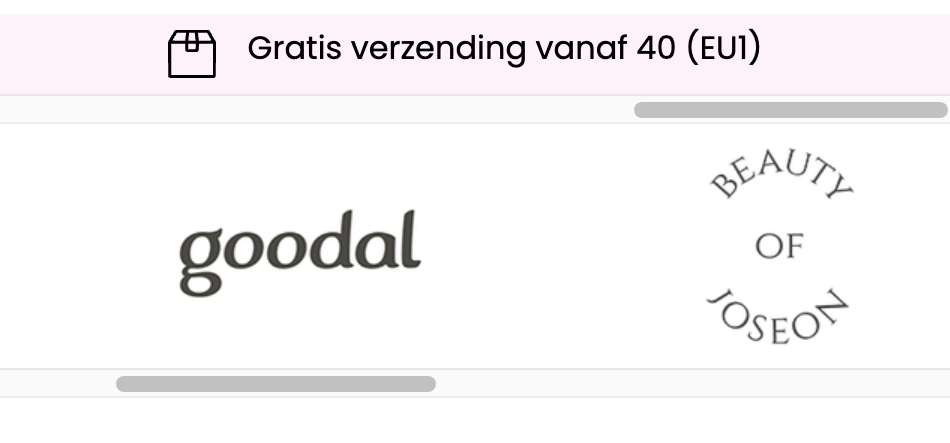

# Procesverslag
Markdown is een simpele manier om HTML te schrijven.  
Markdown cheat cheet: [Hulp bij het schrijven van Markdown](https://github.com/adam-p/markdown-here/wiki/Markdown-Cheatsheet).

Nb. De standaardstructuur en de spartaanse opmaak van de README.md zijn helemaal prima. Het gaat om de inhoud van je procesverslag. Besteedt de tijd voor pracht en praal aan je website.

Nb. Door *open* toe te voegen aan een *details* element kun je deze standaard open zetten. Fijn om dat steeds voor de relevante stuk(ken) te doen.

## Jij

  
uitwerken voor kick-off werkgroep

  ### Auteur:
  Thi Du

  #### Je startniveau:
  Blauw

  #### Je focus:
  Surface plane
 

## Je website

  
uitwerken voor kick-off werkgroep

  ### Je opdracht:
  https://koreanskincare.nl/nl

  #### Screenshot(s) van de eerste pagina (small screen): 
  Homepage van Korean Skincare:  

  

  #### Screenshot(s) van de tweede pagina (small screen):
  Een product pagina van Korean skincare:

  
 

## Toegankelijkheidstest 1/2 (week 1)

  
uitwerken na test in 2e werkgroep

  ### Bevindingen
  Lijst met je bevindingen die in de test naar voren kwamen:
  - Er wordt netjes aangegeven waar je je bevindt, zoals in de navigatiebalk of in de footer.
  - Ze hebben veel list items gemaakt in de website en voor de titels veel level 3 headings
  - Linkjes bij images, buttons en tekst.
  -  Wanneer je in een toolbar bent waar de producten worden weergegeven leest hij een hele tekst voor wat nogal verwarrend is.

## Breakdownschets (week 1)

  
uitwerken na afloop 3e werkgroep

  ### de hele pagina: 

  

  ### dynamisch deel (bijv menu): 

  

## Voortgang 1 (week 2)

  
uitwerken voor 1e voortgang

  ### Stand van zaken
  Hier dit ging goed & dit was lastig (neem ook screenshots op van delen van je website en code)

  In deze week ging ik vooral de website bekijken die ik ga namaken en verbeteren (koreanskincare.nl).
  Ik zal gebruik maken van de site extract.pics om de meeste images uit de website te kunnen downloaden, die heb ik vorig jaar ook gebruikt. 

  Homepagina:

Aan het begin van de pagina zie je een carroussel met verschillende posters, ik zie dat er tekst op elke poster en dat is niet gemaakt met html css, ik zal de tekst van de posters eruit moeten editen en zelf met html css verschillende stijlen qua lettertype zoeken en toepassen. 

 

Dit lijkt mij nogal een lastig stukje om te maken omdat het een carroussel is met images en tekst, buttons maar het heeft ook een filter functie en dot buttons onderaan om te navigeren. Wanneer je over een afbeelding hovert verandert hij van plaatje en het heeft een soort inzoom animatie. Ik zal in de komende voortgangsgesprekken hier vragen over stellen en research over doen.

  

De 5 plaatjes kan ik toepassen met grid, ik heb hierover ook in de lessen geoefendmet grid en zal dit toepassen op mijn site.

 

  Mijn vragen:
  - Zou ik alles moeten maken van de gekozen pagina's?
  - Hoe zou ik de h2 titels met een streep moeten maken?
  - Hoe zorg je ervoor dat wanneer je over een product plaatje hovered dat die verandert naar een ander product plaatje?

  ### Agenda voor meeting
Diya:
- Hoe maak je de rating?
- Verschillende tabs openen op dezelfde pagina, filter?

Thi:
 - Zou ik alles moeten maken van de gekozen pagina's?
  - Hoe zou ik de h2 titels met een streep moeten maken?
  - Hoe zorg je ervoor dat wanneer je over een product plaatje hovered dat die verandert naar een ander product plaatje?

Giulietta:
- Hoe laat je bubbels komen uit de cursor?
- Kun je nu nog veranderen van focus? van responsive naar surface plane?

Keysha:
- Hoe maak je verschillende tabs die je kunt openen op dezelfde pagina?
- Hoe voeg je een tabel samen in carroussel?

  ### Verslag van meeting
  Hier na afloop snel de uitkomsten van de meeting vastleggen:

  -  Maak verschillende dingen van de pagina, herhalende dingen kan je weglaten.- Met h2::before{}. h2::after{} kun je de strepen maken voor de kopjes/titels.
  - Hover image, transition, opacity- en animatie toevoegen.
  - Zoeken naar bubbels animaties op internet om toe te voegen aan de cursor.
  - Je kunt nog van focus veranderen, wel graag doorgeven.
  - Hover werkt niet op telefoon, alleen met cursor.
  - Grid maken voor je lijst of in je lijst
  - Voor de carroussel kun je de site: gebruiken. (Student assistente keurt het goed)

  We hebben het nagevraagd aan Sanne of we die carroussel konden gebruiken, maar die gebruikt wel een andere javascript library. Dit werd niet goedgekeurd door Sanne dus konden we die carroussel toch niet gebruiken.

## Voortgang 2 (week 3)

  
uitwerken voor 2e voortgang

  ### Stand van zaken

 Als eerst wilde ik beginnen aan de navigatie:

Ik verzamelde eerst alle iconen. Daarna ging ik de iconen op de goede grootte maken in css. Toen ging ik met flexbox werken om het naast elkaar te krijgen en te laten centreren. De Logo heb ik als h1 gemaakt. Ik had wel wat moeite met in de juiste volgorde zetten. Doordat ik de logo als h1 heb gemaakt, begint hij als eerst op de pagina maar hij moet in het midden staan van de nav iconen, dus dit was even uitvogelen.

In de les heb ik ook geleerd dat je het met order de volgorde kunt veranderen, dit heb ik toegepast op de iconen en uiteindelijk is het gelukt.

Daarna ging ik verder met het hamburger menu. Wanneer je op de hamburger menu klikt schuift er een scherm uit met allemaal content waar je naartoe kunt navigeren. Ook zijn er soort filter buttons bovenaan. 

Het hamburger menu heb ik al eerder gemaakt in FED 24-25 Blok 1 Oefening JS 3-stap oefening 2 in de les. Dit heb ik ook meegenomen voor mijn site. Die oefening ging ook wel goed, dus kon ik makkelijk toepassen in mijn site. 

Ik had een probleem dat de andere elementen in. mijn main overlappen met de schuifscherm van de hamburger menu. Dit heb ik in de les nagevraagd aan mijn medestudent Diya, zij heeft geleerd van de studentenassistent dat je het kan fixen door de z-index hoog te zetten bijv hier op 1000. Het probleem is toen opgelost.

Ik heb meer style sheets gemaakt om het zo geordend te houden en makkelijk dingen kan teruginden en aanpassen: 

Daarnaast vond ik het handig om meerdere mapjes te maken voor images:, zodat ik makkelijker kan vinden waar de images staan om die te benoemen in mijn html code.

  ### Agenda voor meeting
Diya:
- Hoe maak je de carroussel?
- Ik heb wat problemen met nth-of-child, hoe fix ik dit?

Thi:
- Hoe zet ik de navigatie buttons op de juiste plek?
- Hoe zet ik het kruisje helemaal naar rechts?
- Mijn img nav icons die willen niet goed op size hoe fix ik dit?

Giulietta:
- Hoe krijg ik de video goed in de achtergrond?
- Ik heb veen classes en id's, mag dat?
- Hoe maak je de nav sticky?

Keysha:
- Hoe verander je de kleur van een svg?
- Hoe krijg ik de tweede nav balk?
- Waarom is er aan de boven kant van mijn site een kleine pijl te zien?

  ### Verslag van meeting
  hier na afloop snel de uitkomsten van de meeting vastleggen

- Kijk goed wat een link of button moet zijn op de site
- Maak 2 navs, 1 voor hamburger menu en 1 voor de zoekbutton, login, winkelmand etc.
- Gebruik justify-self: end; om de cross te verplaatsen op het einde (staat bij grid oefening 2)
- Svg met filter:invert(1); om wit of zwart te krijgen voor een icoon
- nth-of-type ipv nth of child hij telt dan beter op volgorde.
- Probeer in inspect site met pijltool te kijken of er padding of margin zit om die onnodige witruimtes te verwijderen.
- Haal de classes en ID's eruit, gebruik echt pseudoclasses.

## Toegankelijkheidstest 2/2 (week 4)

  
uitwerken na test in 9e werkgroep

  ### Bevindingen
  Lijst met je bevindingen die in de test naar voren kwamen (geef ook aan wat er verbeterd is):

## Voortgang 3 (week 4)

  
uitwerken voor 3e voortgang

  ### Stand van zaken
  Hier dit ging goed & dit was lastig (neem ook screenshots op van delen van je website en code)

  Dit is het voorbeeld van de officiële site van de footer: 

  

Voor de footer heb ik gebruik gemaakt van summary en details Op deze pagina heb ik gelezen hoe je het kan doen. https://developer.mozilla.org/en-US/docs/Web/HTML/Element/details De footer menu moet namelijk worden uitgeklapt. 

Toen ben ik verder gegaan met de styling, want er moet een zwarte lijn onder elke kop en ook een plus/min icoon aan de rechterkant. Ik heb hiervoor hulp gevraagd aan chat gpt.

Ik ging daarna verder met de contact details onderaan voor whatsapp en email. Ik heb dat in dezelfde section gemaakt en het list items van gemaakt, zo kan ik het ook met flexbox stylen.

Ik zat daarna wel met het probleem dat de link (a) allemaal een underline krijgen:

Dit komt doordat ik het in de code de ul niet specifiek heb genoemd voor alleen de contact detail maar het alle linkjes styled. Ik heb daarom de ul van de footermenu ook gespecificeerd in css. 

Ik heb ook een animatie toegevoegd voor de plusjes en minnetjes, ze draaien 360 graden als je eroverheen hovert, dit is een soort trigger voor de gebruikers om het menu uit te klappen. 
Ik heb hiervoor gebruik gemaakt van de oefening die we in de les hadden gedaan: Codepen FED24/25 Animaties Oefening 1.

Nu is de footermenu klaar en ziet het er zo uit:

Ik heb een probleem met 2 images van de productmerken. De 2 plaatjes die zien er ingedeukt uit terwijl de andere wel goed op grootte te zien zijn.

Dit heb ik opgelost door in de code height: auto te zetten, dit zorgt ervoor dat de hoogte van alle afbeeldingen juist zijn ingesteld.

Nu is het opgelost en hebben die afbeeldingen ook de juiste grootte gekregen:

### Agenda voor meeting
  samen met je groepje opstellen

  Diya: 
  -  Hoe moet ik de tweede menu toevoegen
  - Hoe moet ik de buttons stijlen
  - Hoe haal ik de achtergrond eruit 

Thi:
- Tekst bij mijn plaatjes mag dat? of alles zelf maken?
- Hoe maak ik de filter tabs in mijn hamburgernav en op mijn pagina's
- De images in mijn collage bewegen mee wanneer je responsive 
- Surface plane, mijn website heeft al veel animaties tellen die mee voor surface plane als ik die namaak of moet ik weer nieuwe toevoegen?

Giulietta:
- Hoe maak ik de producten netjes met prijs button en tekst?
- Hoe laat ik die tekst springen naar beneden?

  ### Verslag van meeting
  hier na afloop snel de uitkomsten van de meeting vastleggen

  - Je mag geen tekst op de plaatjes, je moet ze zelf maken per plaatje. Handig als je goed bent in Photoshop om alle tekst weg te halen.
  - Sybren zal codepen sturen voor de filterfunctie.
  - De animaties die je namaakt van de originele site tellen mee voor de surface plane, zelf kun je altijd wat meer toevoegen om alle 5 dingen van de surfaceplane af te strepen.
  - Gebruik display flex en flex wrap
  - Afbeelding grijze filter over heen-> ::before (even video zoeken)
  - order -1 gebruiken 

## Voorbereiden herkansing (week 6)

  
uitwerken voor het herkansingmoment

  ### Stand van zaken

Om de filter werkend te krijgen heb ik tijdens de 4e voortgangsgesprek hulp gekregen van Sanne. Tijdens het gesprek heeft hij een codepen gemaakt en de stappen uitgelegd. Het zag er veel makkelijker uit dan ik dacht!

Thuis ging ik de filter in mijn site in elkaar zetten en ben ik tegen een aantal obstakels tegengekomen. 

Er zit teveel ruimte aan de onderkant van de button, de tekst zit daardoor niet precies in het midden. In de codepen die Sanne had gemaakt zit hij wel gewoon goed in het midden. Ik heb verschillende manieren geprobeerd en gekeken in mijn code of ik iets heb gedaan bij andere stukken tekst, maar ik zie niet precies waar het door komt. Dit gebeurd nadat ik de "appearance:none;" neerzet, zodat de radiobutton wordt verwijderd. 

Ik heb ook gekeken of het aan mijn font ligt, maar dat is niet zo.. Ook heb ik gevraagd aan CHATGPT of die in mijn code kan kijken waar het aan ligt, maar de suggesties die hij geeft en toe pas in mijn code blijken het niet op te lossen. 

Uiteindelijk heeft Keysha mij kunnen helpen om dat op te lossen. Ze zei dat je het met height kunt fixen. Met flex kun je het tekst daarna precies in het midden krijgen. 

Een aantal afbeeldingen zijn heel erg klein (zie linksonder in de afbeelding) en de rest hebben wel dezelfde grootte, ik dacht dat het aan het bestand lag, maar als ik die verwijder dan gaan opeens de andere afbeeldingen kleiner worden. Dus ging ik het bewerken in de css code.

Uiteindelijk heb ik het opgelost door ook de "li" op te noemen dus niet alleen "ul img", maar "ul li img".

Uit de les FED 24-25 - Blok 1 - Oefening positioneren heb ik geleerd hoe je tekst kunt positioneren op een plaatje. Dit heb ik toegepast op de button om hem onderaan het plaatje te krijgen en de tekst "nieuw" rechtsboven.

De officiele website heeft de navigatiedots OP de posters staan, wat het onoverzichtelijk en rommelig maakt. Ik wil de navigatiedots onder de posters hebben. 

## Eindgesprek herkansing (week 7)

  
uitwerken voor eindgesprek

  ### Je uitkomst - karakteristiek screenshots:

  

  ### Dit ging goed/Heb ik geleerd: 

  Ik heb veel geleerd tijdens de lessen, ik vond dat de lessen heel erg helpen met het maken van mijn website en er duidelijk word uitgelegd. Ik heb veel oefeningen ook toegepast op mijn site.
  - Ik heb geleerd om het hamburger menu te maken en ook met javascript.
  - Met grid werken voor de poster indeling van de tekst (Dit heb ik met Sanne gemaakt tijdens de laatste les)
  - Met x-overflow scroll de sliders horizontaal te laten scrollen 
  - Details summary gebruiken om een uitklapmenu te maken.
  - Met @keyframe animaties maken op een makkelijke manier

  Ik ben heel tevreden met de footer, ik vind dat het er netjes uitziet en veel lijkt op de originele pagina. Ook vond ik het leuk om te maken vooral de animatie vind ik een leuke toevoeging. 

  ### Dit was lastig/Is niet gelukt:

  Het is mij niet gelukt om alles af te maken voor de deadline. Wel heb ik geprobeerd om zo ver mogelijk te komen. Ik heb mij vooral gefocust op de eerste pagina, want veel dingen komen in de 2e pagina in terug. 

  - De carroussel is ook nog niet gelukt om werkend te krijgen. Ik had met Sanne in de les de navigatie bolletjes op de juiste manier proberen te maken zodat hij naar slide naar elke poster, maar hij gaat alleen naar 1 poster als je erop drukt. Dit wil ik nog fixen. 

  - De filteropties vind ik ook nog moeilijk om voor elkaar te krijgen, ik ga dit nog uitvogelen en hulp vragen aan studentenassistenten. 

  - De filteroptie moet ik ook toepassen op mijn hamburger menu, daarom is die nog niet af. 

  - De tekst op mijn posters moet ik ook nog toevoegen, dit zal ik nog doen.

  - Surface plane onderwerpen heb ik nog niet toegepast, ik was vooral bezig met het namaken van de site. Ik heb wel een animatie toegepast, maar ik weet niet of dat al genoeg is voor 1 onderwerp van de surfaceplane. Wel heb ik al een idee welke dingen ik wil toevoegen, namelijk: 
- [x] Animaties (plusicoon)
- [ ] Werkend filterfunctie
- [ ] Werkend zoekfunctie
- [ ] Style/animate SVG icons
- [ ] Iets met video?

Tijdens het valideren van mijn index pagina, heb ik een error gekregen bij mijn nav 1, ik had blijkbaar geen nav open geplaatst maar wel nav sluit. Dit zal ik later moeten aanpassen, want dit moet ik in css met pseudoclasses weer aangeven aangezien ik 2 navs heb.

  

  Wat ik beter kon doen is mijn read-me up to date houden tijdens dat ik bezig ben met coderen, dit heb ik niet gedaan maar pas op laatste moment, waardoor ik veel terug moest zoeken en veel moet schrijven. De meeste dingen staan er nu erin, maar ik wil nog wat uitleg en screenshots toevoegen om het meer compleet te maken.

## Bronnenlijst

  
continu bijhouden terwijl je werkt

  Nb. Wees specifiek ('css-tricks' als bron is bijv. niet specifiek genoeg). 
  Nb. ChatGpT en andere AI horen er ook bij.
  Nb. Vermeld de bronnen ook in je code.

Footer plus en min toevoegen bij het uitklapmenu:
  1. Chatgpt.com:

  2. Codepen van Anne-Kyra Strik voor de h2 lijnen styling: https://codepen.io/the_legends_of_panda/pen/rNXBEPK?editors=1100
  3. Codepen van Sybren Loos voor de filterfunctie: https://codepen.io/thi-dn/pen/LYwdygO?editors=1100
  4. Codepen van Sybren Loos voor de carroussel: https://codepen.io/Sybje123456789/pen/VwoMaxZ
  5. Codepen FED24/25 Animaties Oefening 1 (animaties plus icoon): https://codepen.io/shooft/pen/wvLjNPo?editors=1100
  6. Codepen FED 24-25 Blok 1 Oefening JS 3-stap oefening 2 
  7. Footer uitklapmenu maken met details summary: https://developer.mozilla.org/en-US/docs/Web/HTML/Element/details
  8. Font omzetten naar woff bestand https://www.fontsquirrel.com/tools/webfont-generator
  9. FED 24/25 - Positioneren - Oefening 1 

